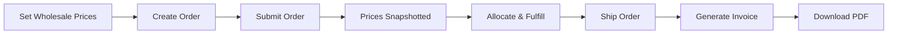
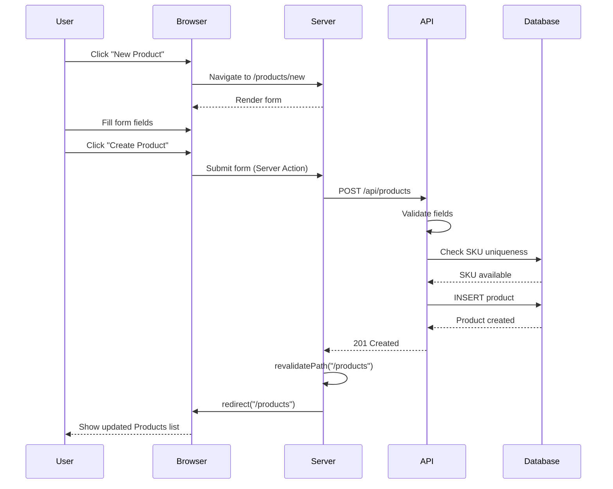
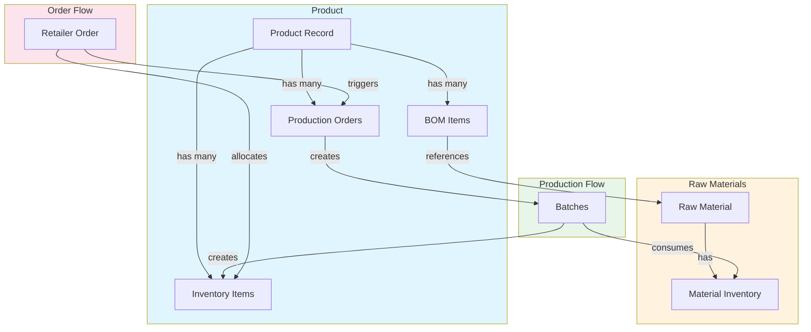
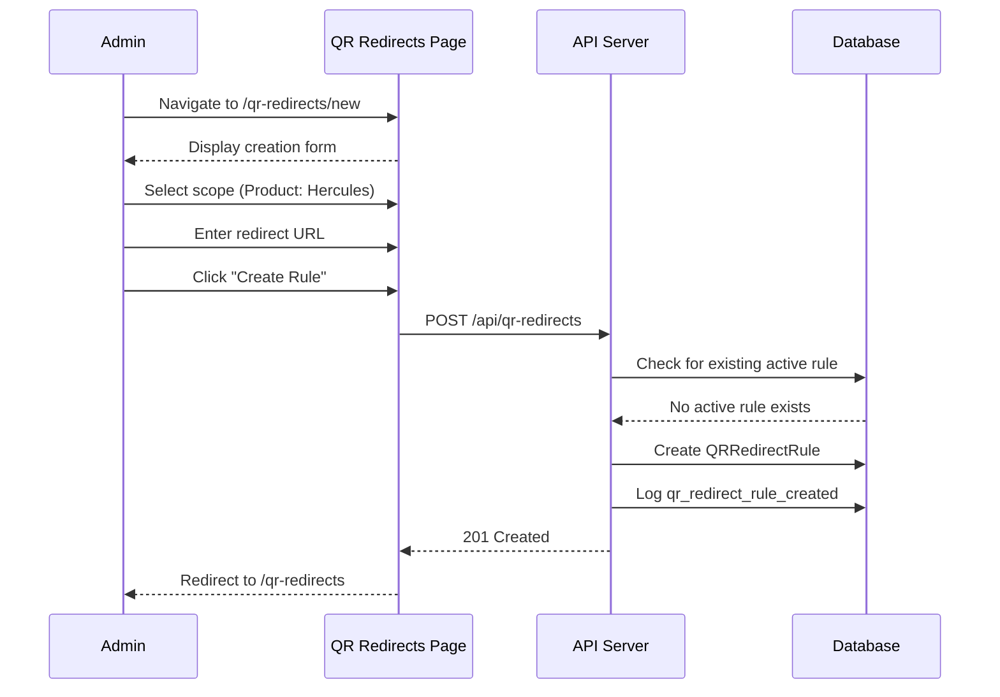
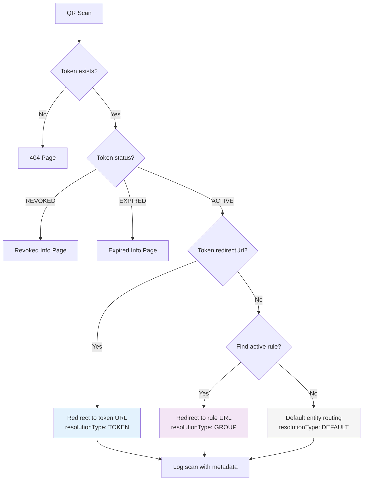

# PsillyOps User Manual

**Version 0.13.0**  
**Last Updated: December 13, 2024**

---

## Table of Contents

1. [Overview](#overview)
2. [Getting Started](#getting-started)
3. [User Roles](#user-roles)
4. [Admin Guide](#admin-guide)
5. [Production Guide](#production-guide)
6. [Warehouse Guide](#warehouse-guide)
7. [Wholesale Pricing & Invoicing](#wholesale-pricing--invoicing)
8. [Sales Rep Guide](#sales-rep-guide)
9. [Product Management](#product-management)
10. [Feature Tutorials](#feature-tutorials)
11. [QR Workflows](#qr-workflows)
    - [QR Redirect Management](#qr-redirect-management-admin-only)
    - [QR Token Detail Page](#qr-token-detail-page-admin-only)
    - [QR Behavior Panel](#qr-behavior-panel-entity-detail-pages)
12. [Label Templates](#label-templates)
13. [AI Tools](#ai-tools)
14. [Tooltips & Quick Help](#tooltips--quick-help)
15. [Troubleshooting](#troubleshooting)
16. [Glossary](#glossary)

---

## Overview

PsillyOps is a comprehensive inventory management system designed for mushroom supplement production. The system tracks:

- **Finished products** and **raw materials** across locations
- **Production batches** with full traceability
- **Retailer orders** with automatic allocation
- **Material requirements** with automated purchasing suggestions
- **Vendor performance** and lead times

### Key Features

- ✅ **Automatic Allocation**: Orders automatically allocate inventory using FIFO
- ✅ **MRP Engine**: Detects shortages and suggests production/purchase orders
- ✅ **QR Code Tracking**: Scan batches and inventory for instant updates
- ✅ **Intelligent Logging**: Complete audit trail with field-level changes
- ✅ **Real-time Dashboards**: Monitor inventory, orders, and production
- ✅ **Role-Based Access**: Secure permissions for each user type
- ✅ **Wholesale Pricing**: Set product prices with automatic order snapshots
- ✅ **Invoicing**: Generate PDF invoices from shipped orders
- ✅ **Packing Slips**: Create shipping manifests for fulfillment

---

## Getting Started

### Logging In

1. Navigate to the PsillyOps URL
2. Enter your email and password
3. Click "Sign In"

**Test Credentials:**
- Admin: `admin@psillyops.com` / `password123`
- Production: `john@psillyops.com` / `password123`
- Warehouse: `mike@psillyops.com` / `password123`
- Sales Rep: `sarah@psillyops.com` / `password123`

### First-Time Setup

After logging in for the first time:
1. Review your assigned retailers (Sales Reps)
2. Familiarize yourself with the navigation menu
3. Check current inventory levels
4. Review any pending orders or production tasks

---

## User Roles

### Admin
- **Full system access**
- Manages users, products, materials, vendors
- Approves orders and oversees all operations
- Access to analytics and reporting

### Production
- Creates and manages production orders
- Tracks batches through production stages
- Assigns makers to batches
- Completes batches and creates inventory

### Warehouse
- Manages inventory movements
- Adjusts stock levels
- Picks and ships orders
- Receives purchase orders
- Scans QR codes for tracking

### Sales Rep
- Manages assigned retailer accounts
- Creates and submits orders
- Tracks order status
- Views product availability

---

## Admin Guide

### Managing Products

**View Products List:**
1. Navigate to **Products** in the sidebar
2. View all active products with SKU, unit, reorder point, and BOM item count
3. Click **"View"** to open product details
4. Click **"New Product"** to create a new product

**Create a New Product:**
1. Navigate to **Products** → Click **"New Product"**
2. Fill in required fields:
   - **Name**: Product display name (e.g., "Lions Mane Tincture")
   - **SKU**: Unique identifier (e.g., "LM-TINCT-30")
   - **Unit of Measure**: Select from jar, bottle, pouch, bag, box, case, unit, each, pack
3. Fill in optional fields:
   - **Reorder Point**: Stock level that triggers reorder alerts (default: 0)
   - **Lead Time Days**: Production/restock time in days (default: 0)
   - **Default Batch Size**: Standard production quantity per batch
4. Click **"Create Product"**
5. You will be redirected to the Products list

**View Product Details:**
1. Go to **Products** → Click **"View"** on any product
2. The detail page shows:
   - **Header**: Product name, SKU badge, archive status
   - **Details Card**: Unit, reorder point, lead time, default batch size
   - **Inventory Summary**: Total on hand and breakdown by location
   - **BOM Card**: List of materials with quantities per unit
   - **Recent Production**: Last 5 production orders with status

**Edit a Product:**
1. Open the product detail page
2. Click **"Edit"** button
3. Modify any field in the inline form:
   - Name, SKU, Unit of Measure
   - Reorder Point, Lead Time Days, Default Batch Size
4. Click **"Save Changes"**
5. Changes are saved immediately

**Archive a Product:**
1. Open the product detail page
2. Click **"Archive"** button
3. Confirm the action in the dialog
4. Product is soft-deleted (marked inactive) and removed from active lists
5. You are redirected to the Products list

**Edit BOM (Bill of Materials):**
1. Go to **Products** → Select product → Click **"Edit BOM"** button
2. **Current Materials** section shows all configured materials
3. To add a material:
   - Select material from dropdown
   - Enter quantity per unit (e.g., 1.5 kg)
   - Click **"Add"**
4. To edit quantity:
   - Click **"Edit"** on the material row
   - Update the quantity value
   - Click **"Save"**
5. To remove a material:
   - Click **"Remove"** on the material row
   - Confirm the removal
6. Click **"Back to Product"** when done

### Managing Strains

Strains are a lookup table used to categorize products by their active ingredient source (e.g., "Penis Envy", "Golden Teacher", "Lions Mane"). Products can optionally be associated with a strain, enabling better organization, AI command resolution, and filtering.

#### Strain Management Page (ADMIN Only)

1. Navigate to **Strains** in the sidebar
2. View all active strains with short code, aliases, and product count
3. Click **"Show Archived"** to view archived strains

#### Creating a New Strain

1. Fill in the form at the top of the Strains page:
   - **Name**: Full strain name (e.g., "Penis Envy")
   - **Short Code**: Abbreviation for AI commands (e.g., "PE")
   - **Aliases**: Optional comma-separated alternative names (e.g., "P. Envy, PenisEnvy")
2. Click **"Add Strain"**
3. The strain will appear in the list below

#### Pre-seeded Strains

The following strains are pre-seeded:

| Short Code | Name | Example Aliases |
|------------|------|-----------------|
| **PE** | Penis Envy | P. Envy, PenisEnvy |
| **GT** | Golden Teacher | GoldenTeacher |
| **APE** | Albino Penis Envy | Albino PE |
| **FMP** | Full Moon Party | FullMoonParty |
| **LM** | Lions Mane | Lion's Mane, LionsMane |
| **RE** | Reishi | Ganoderma |
| **CORD** | Cordyceps | Cordyceps Militaris |
| **CHAG** | Chaga | Inonotus obliquus |

#### Assigning Strains to Products

1. When creating or editing a product, select a strain from the **Strain** dropdown
2. The strain badge will appear in:
   - Product header (e.g., "PE: Penis Envy")
   - Product details grid
   - Products list strain column

#### AI Command Resolution

The AI command system understands strain abbreviations:

```
"Mighty Caps PE" → Product with name containing "Mighty Caps" AND strainId = Penis Envy
"MC-PE" → Product with SKU "MC-PE" (exact match)
"Received 100 GT" → Resolves GT to Golden Teacher strain
```

#### Archiving Strains

1. Click **"Archive"** next to a strain
2. Strains with active products cannot be archived (button is disabled)
3. To archive a strain with products, first remove the strain from all products
4. Archived strains can be restored by clicking **"Restore"** when viewing archived strains

### CSV Product Import (ADMIN Only)

Bulk import products using CSV format. Supports strain assignment via name or short code.

#### CSV Format

```csv
name,sku,strain,unit,reorder_point,wholesale_price,default_batch_size
Mighty Caps - Penis Envy,MC-PE,PE,jar,50,24.99,100
Mighty Caps - Golden Teacher,MC-GT,Golden Teacher,jar,50,24.99,100
Basic Caps,BASIC-001,,jar,25,19.99,50
```

| Column | Required | Description |
|--------|----------|-------------|
| name | Yes | Product display name |
| sku | Yes | Unique product SKU |
| strain | No | Strain name or short code (e.g., "PE" or "Penis Envy") |
| unit | Yes | Unit of measure (jar, bottle, etc.) |
| reorder_point | No | Default: 0 |
| wholesale_price | No | Default wholesale price |
| default_batch_size | No | Standard batch size |

#### Import Validation

The import process validates:
- All required columns are present
- SKUs are unique (not in database and not duplicated in file)
- Strains exist (if provided)
- Numeric fields are valid

#### How to Import

1. Prepare your CSV file following the format above
2. Send a POST request to `/api/products/import` with the CSV data:
```json
{
  "csvData": "name,sku,strain,unit,reorder_point,wholesale_price,default_batch_size\nMighty Caps - PE,MC-PE,PE,jar,50,24.99,100"
}
```
3. The response includes success count and any row-level errors:
```json
{
  "success": true,
  "totalRows": 10,
  "successCount": 10,
  "errorCount": 0,
  "errors": [],
  "createdProducts": [{ "sku": "MC-PE", "name": "Mighty Caps - PE", "strainName": "Penis Envy" }]
}
```

#### Error Handling

If validation fails, no products are created. The response includes detailed errors:
```json
{
  "success": false,
  "totalRows": 10,
  "successCount": 0,
  "errorCount": 2,
  "errors": [
    { "row": 3, "sku": "MC-PE", "errors": ["SKU \"MC-PE\" already exists"] },
    { "row": 5, "sku": "NEW-001", "errors": ["Unknown strain: \"INVALID\""] }
  ],
  "createdProducts": []
}
```

### Managing Materials

Materials are the raw ingredients, packaging components, and other inputs needed to produce finished products. PsillyOps tracks materials with full vendor relationships, cost history, and attachments.

#### Material Categories

Materials are organized into categories for easier management:

| Category | Description | Examples |
|----------|-------------|----------|
| **Raw Botanical** | Plant-based raw ingredients | Mushroom powders, herb extracts |
| **Active Ingredient** | Concentrated active compounds | Standardized extracts |
| **Excipient** | Inactive filler/binder ingredients | Cellulose, starch |
| **Flavoring** | Taste/aroma additives | Natural flavors, sweeteners |
| **Packaging** | Containers and closures | Jars, bottles, caps |
| **Label** | Product labels and inserts | Printed labels, instruction cards |
| **Shipping** | Shipping materials | Boxes, bubble wrap, tape |
| **Other** | Miscellaneous items | Cleaning supplies |

#### Material List Page

1. Navigate to **Materials** in the sidebar
2. View all active materials with:
   - Name and unit of measure
   - Category badge
   - SKU
   - Preferred vendor
   - Current cost (from preferred vendor)
   - Lead time and reorder point
3. Click **"View"** to see material details
4. Click **"New Material"** to create a new material

#### Creating a New Material

1. Navigate to **Materials** → Click **"New Material"**
2. Fill in required fields:
   - **Name**: Material display name (e.g., "Lion's Mane Powder")
   - **SKU**: Unique identifier (e.g., "MAT-LM-001")
   - **Category**: Select from dropdown
   - **Unit of Measure**: How the material is counted (kg, pcs, L, etc.)
3. Fill in optional MRP fields:
   - **Reorder Point**: Stock level that triggers alerts (default: 0)
   - **Reorder Quantity**: Suggested order quantity (default: 0)
   - **MOQ (Minimum Order Quantity)**: Smallest order allowed (default: 0)
   - **Lead Time Days**: Procurement time in days (default: 0)
   - **Description**: Notes and specifications
4. Click **"Create Material"**

#### Material Detail Page

The material detail page shows comprehensive information:

**Header Section:**
- Material name with SKU badge
- Category badge with color coding
- Active/Archived status indicator
- Edit, Archive, and QR buttons

**Overview Card:**
- Unit of measure, reorder point, reorder quantity
- MOQ and lead time
- Current cost from preferred vendor
- Description text

**Inventory Summary:**
- Total quantity on hand
- Breakdown by storage location
- Low stock warning when below reorder point

**Vendors Card:**
- Table of all vendor relationships
- Price, MOQ, lead time per vendor
- Preferred vendor indicator
- Quick actions to set preferred vendor

**Cost History:**
- Timeline of price changes
- Vendor name for each entry
- Source (PO, Manual, Import)

**Attachments:**
- List of attached documents (COA, MSDS, Spec sheets)
- Quick add/remove attachments

**BOM Usage:**
- List of products that use this material
- Quantity per unit for each product

#### Managing Vendor Relationships

Each material can have **multiple vendors** with different pricing and terms. This allows you to:
- Compare pricing from different suppliers
- Have backup sources for critical materials
- Track vendor-specific MOQ and lead times
- Maintain historical cost data from all vendors

**Understanding Preferred Vendors:**

Each material may have exactly **one preferred vendor** at a time. The preferred vendor designation determines:
- **Default Cost**: The preferred vendor's price is used as the material's "current cost" in the UI
- **BOM Cost Rollups**: Product costing calculations use the preferred vendor's price for each material
- **Purchase Order Defaults**: When creating POs, the preferred vendor's pricing is pre-filled
- **MRP Suggestions**: Reorder suggestions use preferred vendor lead times where available

When you set a new vendor as preferred, **all other vendors for that material are automatically set to non-preferred**. Only one vendor can be preferred per material.

**Add a Vendor to Material:**
1. Open material detail page
2. Click **"Manage Vendors"** link
3. Select vendor from dropdown
4. Enter vendor-specific details:
   - Price per unit
   - MOQ for this vendor
   - Lead time for this vendor
   - Notes
5. Optionally check "Set as preferred vendor"
6. Click **"Add Vendor"**

**Set Preferred Vendor:**
1. Open material detail page or vendor management page
2. Click **"Set Preferred"** next to the desired vendor
3. Previous preferred vendor is automatically unset
4. Material's cost calculations will use preferred vendor's price

#### Editing Vendor Relationships

You can edit vendor relationships inline without navigating away from the page.

**Inline Editing:**
1. Go to material's vendor management page
2. Click **"Edit"** on the vendor row
3. Update any of the following:
   - **Price**: Cost per unit from this vendor
   - **MOQ**: Minimum order quantity required by this vendor
   - **Lead Time**: Days from order to delivery
   - **Notes**: Any additional information
4. Click **"Save"**

**Automatic Cost History Updates:**
When you change a vendor's price, PsillyOps automatically creates a `MaterialCostHistory` entry. This means:
- All price changes are tracked with timestamps
- You can see the full price history in the Cost History section
- The source is recorded as "VENDOR_UPDATE"

**Removing a Vendor Relationship:**
1. Click **"Remove"** on the vendor row
2. Confirm the removal

**Important:** Removing a vendor relationship:
- Does **NOT** delete the vendor from the system
- Does **NOT** delete past cost history entries for that vendor
- **Does** remove that vendor from future cost calculations for this material
- If the removed vendor was preferred, the material will have no preferred vendor until you set a new one

> **See also:** [Product Costing](#bom-editor) for how material costs flow into product costs, and [MRP Integration](#mrp-integration) for how vendor lead times affect ordering suggestions.

#### Cost History Tracking

PsillyOps automatically tracks material cost changes:

- Price changes from vendor updates are logged
- Purchase order receipts record actual costs
- Manual cost entries can be added
- Full audit trail with dates and sources

**View Cost History:**
1. Open material detail page
2. Scroll to "Cost History" section
3. View price changes over time
4. Note vendor and source for each entry

#### Material Attachments

Store important documents with materials. Attachments are currently **link-based only**, meaning you store references to externally hosted files rather than uploading files directly to PsillyOps.

**Supported Document Types:**
- **COA** - Certificate of Analysis
- **MSDS** - Material Safety Data Sheet  
- **SPEC** - Specification Sheet
- **OTHER** - Any other document

**How Attachments Work:**

Attachments consist of three fields:
1. **fileName**: The display name (e.g., "Lions_Mane_COA_2024.pdf")
2. **fileUrl**: The link to the actual file
3. **fileType**: Category of document (COA, MSDS, SPEC, OTHER)

**Add an Attachment:**
1. Open material detail page
2. Click **"+ Add Attachment"**
3. Enter the file name for display
4. Paste the URL from your external storage:
   - Google Drive sharing link
   - Dropbox sharing link
   - S3 pre-signed URL
   - Any publicly accessible URL
5. Select document type
6. Click **"Add Attachment"**

**External Storage Workflow:**
1. Upload your PDF, image, or document to Google Drive, Dropbox, S3, or similar
2. Generate a sharing link or public URL
3. Paste that URL into PsillyOps when adding the attachment

**Note:** Binary file uploads are not yet supported. Future versions may support direct uploads to PsillyOps storage.

**Deleting Attachments:**

When you delete an attachment from PsillyOps:
- Only the **link record** is removed from PsillyOps
- The **underlying file** is NOT deleted from Google Drive, Dropbox, or any external system
- You must delete the actual file separately if needed

#### Material QR Codes

Each material has a unique QR code for quick access. The QR code routes to `/qr/material/[materialId]` and displays different information based on the viewer's authentication and role.

**Generating and Using QR Codes:**
1. Open material detail page
2. Click the QR icon button in the header
3. QR page opens in new tab
4. Print and attach to storage bins, shelves, or receiving areas

**Role-Based Data Visibility:**

The Material QR page intentionally redacts sensitive information to protect vendor and cost data when appropriate.

| Viewer Type | What They See |
|-------------|---------------|
| **Unauthenticated / External** | Material name, category, SKU, description (if present). **No pricing, no vendor details, no stock numbers.** |
| **Authenticated Internal Users** (Admin, Production, Warehouse) | Full internal view: pricing, preferred vendor, stock levels by location, recent cost updates, low stock warnings, link to full detail page. |
| **REP Role** | Limited view suitable for sales conversations. Basic material info visible; pricing and sensitive purchasing details are hidden. |

**Why Data is Redacted:**
- Vendor pricing is confidential and shouldn't be visible to external parties
- Stock levels may reveal business information you don't want shared
- Internal cost structures should remain internal

> **See also:** [QR Workflows](#qr-workflows) for more information on scanning and using QR codes throughout the system.

#### MRP Integration

Material settings are first-class inputs into PsillyOps's Material Requirements Planning (MRP) engine. These fields directly affect automated ordering and shortage detection.

**Material-Level MRP Fields:**

- **Reorder Point**: System alerts when stock falls below this level. Triggers automated reorder suggestions via the `/api/cron/reorder-check` job.
- **Lead Time (Days)**: Used to calculate when to order. Helps determine if current stock will last until the next delivery.
- **MOQ (Minimum Order Quantity)**: Ensures order quantities meet vendor minimums. POs will suggest at least this quantity.
- **Reorder Quantity**: Suggested quantity for purchase orders. System uses this as the default order amount.

**Vendor-Level Overrides:**

When a material has vendor relationships, the vendor-specific lead time (on `MaterialVendor`) may override or refine the material-level assumption. This enables more accurate planning when different vendors have different delivery times.

**How MRP Uses Material Data:**

1. **Material Shortage Detection**: Production orders calculate material requirements from BOMs. If required quantity exceeds available inventory, a shortage is flagged.
2. **Draft Purchase Order Suggestions**: The reorder-check cron job monitors stock levels against reorder points and generates suggested POs grouped by vendor.
3. **Preferred Vendor Selection**: When generating PO suggestions, the system uses the preferred vendor's pricing and lead time.

> **See also:** [Managing Vendor Relationships](#managing-vendor-relationships) for setting up vendor-specific lead times, and [BOM Editor](#bom-editor) for how material quantities flow into production requirements.

---

### Managing Vendors

Vendors are suppliers who provide materials to your operation.

#### Vendor List Page

1. Navigate to **Vendors** in the sidebar
2. View all active vendors with:
   - Name and contact info
   - Number of materials supplied
   - Default lead time
3. Click **"View"** to see vendor details
4. Click **"New Vendor"** to create a new vendor

#### Creating a New Vendor

1. Navigate to **Vendors** → Click **"New Vendor"**
2. Fill in fields:
   - **Name**: Company name (required)
   - **Contact Name**: Primary contact person
   - **Email**: Contact email address
   - **Phone**: Contact phone number
   - **Address**: Full mailing address
   - **Payment Terms**: e.g., "Net 30"
   - **Default Lead Time**: Standard delivery time in days
   - **Notes**: Additional information
3. Click **"Create Vendor"**

#### Vendor Detail Page

The vendor detail page shows:

**Header Section:**
- Vendor name
- Active/Archived status
- Edit and Archive buttons

**Contact Information:**
- Contact name, email, phone
- Full address

**Business Information:**
- Payment terms
- Default lead time
- Notes

**Materials Supplied:**
- Table of all materials from this vendor
- Category, price, MOQ for each
- Preferred vendor indicators

**Performance Scorecard (Last 90 Days):**
- Total purchase orders
- On-time delivery rate percentage
- Average lead time in days
- Total purchase value

**Recent Purchase Orders:**
- Last 10 POs with status
- Created, expected, and received dates

#### Vendor Performance Tracking

PsillyOps tracks vendor performance metrics to help you evaluate and compare suppliers.

- **On-Time Delivery**: Orders received by expected date
- **Average Lead Time**: Actual days from PO sent to received
- **Total Value**: Sum of all PO values
- **Quality Incidents**: (Future feature)

Use these metrics to:
- Identify reliable vendors
- Negotiate better terms
- Make sourcing decisions

#### Vendor Performance Scorecards

The Vendor Detail page displays a **Performance Scorecard** showing metrics from the last 90 days.

**Scorecard Metrics:**

| Metric | Description | Calculation |
|--------|-------------|-------------|
| **Total POs** | Number of purchase orders sent to this vendor | Count of POs in date range |
| **On-Time Delivery Rate** | Percentage of POs received by expected date | (On-time POs ÷ Total received POs) × 100 |
| **Average Lead Time** | Mean days from PO sent to received | Sum of actual lead times ÷ Number of received POs |
| **Total Purchase Value** | Total dollar amount purchased | Sum of all PO line item values |

**Data Source:**

These metrics are derived from `PurchaseOrder` records and their associated timestamps:
- `sentAt` - When the PO was sent to vendor
- `expectedDeliveryDate` - When delivery was expected
- `receivedAt` - When goods were actually received
- Line item quantities and costs for value calculations

**Note on Historical Data:**

If your historical Purchase Orders are missing or were partially migrated from another system, the scorecard metrics may appear sparse or incomplete. As you process new POs through PsillyOps, the scorecard data will become more accurate and comprehensive.

> **See also:** [Managing Vendor Relationships](#managing-vendor-relationships) for how vendor performance can inform preferred vendor selection.

---

## Production Guide

### Production Dashboard (Kanban Board)

The Production page displays orders in a Kanban-style board with columns:
- **Planned** - Orders awaiting start
- **In Progress** - Active production
- **Blocked** - Orders with issues (shortage, QC, etc.)
- **Completed** - Finished orders

**Order Cards Show:**
- Product name and order number
- Progress bar (produced vs. target)
- Scheduled date
- Work center (if assigned)
- Status tags (Shortage, QC Pending, batch count)

### Creating a Production Order

1. Navigate to **Production** → **"New Production Order"**
2. Select product (must have BOM configured)
3. Enter **Quantity to Make** (total units needed)
4. Set **Batch Size** (optional - defaults from product or template)
5. Select **Scheduled Date** and **Due Date** (optional)
6. Choose **Work Center** (optional - for scheduling)
7. Select **Production Template** (optional - pre-configured settings)
8. Click **"Create Production Order"**

**Material Requirements:**
- System automatically calculates materials from BOM × quantity
- Shows Available vs. Required for each material
- Highlights shortages in red
- Creates `ProductionOrderMaterial` records for tracking

### Work Centers

Work centers represent production areas or equipment:

**Setup Work Centers (Admin):**
1. Navigate to **Settings** → **Work Centers**
2. Click **"Add Work Center"**
3. Enter name and description
4. Click **"Create"**

**Using Work Centers:**
- Assign work center when creating production orders
- View orders by work center for scheduling
- Track utilization across work centers

### Production Templates

Templates save time for recurring production runs:

**Create Template (Admin):**
1. Go to product detail → **Templates** tab
2. Click **"Add Template"**
3. Enter template name
4. Set default batch size
5. Add instructions (optional)
6. Click **"Create"**

**Using Templates:**
- Select template when creating production order
- Template's default batch size auto-fills
- Instructions provide guidance for operators

### Production Order Lifecycle

**Status Flow:**
```
PLANNED → IN_PROGRESS → COMPLETED
                ↓
             BLOCKED → IN_PROGRESS (resume)
                ↓
           CANCELLED
```

**Start Production:**
1. Open production order detail
2. Click **"Start Production"**
3. Status changes to IN_PROGRESS
4. `startedAt` timestamp recorded

**Issue Materials:**
1. Click **"Issue Materials"** on order detail
2. Enter quantities for each material
3. System consumes materials using FIFO (oldest expiry first)
4. Updates `issuedQty` tracking
5. Creates CONSUME movement records

**Block Production:**
1. Click **"Block Order"**
2. Enter reason (shortage, QC issue, equipment failure)
3. Status changes to BLOCKED
4. Logged for audit trail

**Complete Production:**
1. Ensure all batches are RELEASED
2. Click **"Complete Order"**
3. Status changes to COMPLETED
4. `completedAt` timestamp recorded

### Managing Batches

**Create Batch:**
1. From production order, find **"Add Batch"** form
2. Enter planned quantity
3. System generates unique batch code (SKU-DATE-XX)
4. Click **"Add Batch"**

**Track Batch Progress:**
1. Open batch detail page
2. Update status as batch moves through stages:
   - PLANNED → IN_PROGRESS → QC_HOLD → RELEASED
3. Assign makers (production users)
4. Add production notes

**Yield & Loss Tracking:**

When completing a batch, track yield performance:
- **Expected Yield** - Planned output quantity
- **Actual Yield** - What was actually produced
- **Loss Qty** - Units lost during production
- **Loss Reason** - Document cause (waste, equipment, quality)
- **Variance** - Actual vs. Expected (shown on detail page)

**Complete Batch:**
1. When production is done, click **"Complete Batch"**
2. Enter **Actual Quantity** produced
3. Select **Destination Location** (e.g., Finished Goods)
4. Enter **Expected Yield** (if different from planned)
5. Enter **Loss Qty** and **Loss Reason** if applicable
6. Check **"QC Required"** if batch needs quality inspection
7. Click **"Complete"**

**Result:** System creates inventory items at the specified location. If QC required, inventory is QUARANTINED until QC passes.

### QC Status Workflow

Quality Control status tracks batch inspection:

**QC Statuses:**
- **NOT_REQUIRED** - No QC needed (default)
- **PENDING** - Awaiting QC inspection
- **HOLD** - Under investigation
- **PASSED** - Approved for sale
- **FAILED** - Rejected, inventory quarantined

**Update QC Status:**
1. Open batch detail page
2. In QC card, select new status
3. Add notes (optional)
4. Click **"Update QC"**

**QC Impact on Inventory:**
- HOLD/FAILED → Inventory status set to QUARANTINED
- PASSED → Inventory released to AVAILABLE
- PASSED + QC_HOLD batch → Batch status changes to RELEASED

### Labor Tracking

Track time spent on batch production:

**Add Labor Entry:**
1. Open batch detail page
2. In Labor card, select worker from dropdown
3. Enter minutes worked
4. Enter role (optional - e.g., "Mixer", "Packager")
5. Add notes (optional)
6. Click **"Add Labor"**

**View Labor Summary:**
- Labor card shows total minutes and hours
- Table lists all entries with worker, time, role
- Useful for costing and capacity planning

### QR Code Usage

Each batch has a unique QR code:
1. View batch detail page
2. Click QR icon button
3. Opens public batch page with batch info
4. Print labels for physical batches
5. Scan QR codes during production to track progress

---

## Warehouse Guide

### Inventory Dashboard

The Inventory page provides a comprehensive view of all stock:

**Table Columns:**
- **Item** - Product or Material name with SKU
- **Type** - PRODUCT or MATERIAL badge
- **Location** - Where stock is stored
- **On Hand** - Total quantity in location
- **Reserved** - Quantity allocated to orders
- **Available** - On Hand minus Reserved (what can be moved/used)
- **Batch/Lot** - Batch code or lot number for traceability
- **Expiry** - Expiration date with warning colors
- **Status** - AVAILABLE, RESERVED, QUARANTINED, DAMAGED, SCRAPPED

**Filtering:**
- Search by item name, SKU, or lot number
- Filter by Type (Product/Material)
- Filter by Location
- Filter by Status
- Items expiring soon shown with orange/red dates

### Understanding Quantities

**On Hand vs. Reserved vs. Available:**
- **On Hand** - Physical stock in the location
- **Reserved** - Stock allocated to orders but not yet shipped
- **Available** - `On Hand - Reserved` = what you can move or use

**Example:**
- On Hand: 100 units
- Reserved: 30 units (for pending orders)
- Available: 70 units (can be moved or allocated to new orders)

### Receiving Materials

**Process Purchase Order Receipt:**
1. Navigate to **Purchase Orders**
2. Open the PO to receive
3. Click **"Receive"**
4. For each line item:
   - Enter quantity received
   - Enter lot number (if applicable)
   - Enter expiry date (if applicable)
   - Select receiving location
5. Click **"Save Receipt"**

**Result:** 
- Material inventory is updated automatically
- RECEIVE movement record created
- Material `currentStockQty` updated

### Moving Inventory

**Transfer Between Locations:**
1. Go to **Inventory** → Click **"View"** on item
2. Click **"Move Stock"** button
3. Enter **Quantity to Move** (up to Available)
4. Select **To Location**
5. Add **Reason** (optional)
6. Click **"Move Stock"**

**Move Behavior:**
- Full quantity move: Item relocated to new location
- Partial move: Original item reduced, new item created at destination
- If item already exists at destination (same type/batch/lot), quantities combined
- MOVE movement record created for audit trail

**Quick Move with QR Scan:**
1. Go to **QR Scan**
2. Scan batch or inventory QR code
3. Click **"Quick Move"**
4. Select preset location (Packaging, Shipping, etc.)
5. Confirm

### Adjusting Stock

**Manual Adjustment:**
1. Navigate to **Inventory** → Click **"View"** on item
2. Click **"Adjust Stock"** button
3. Enter **Quantity Change** (+/- amount)
   - Positive: Adds stock (found inventory, correction up)
   - Negative: Removes stock (damaged, count correction down)
4. Enter **Reason** (required): "Damaged", "Cycle count", "Shrinkage"
5. Click **"Apply Adjustment"**

**Result:** 
- Stock level updated with full audit trail
- ADJUST movement record created
- Material `currentStockQty` updated (if material)

### Inventory Reservations

**How Reservations Work:**
- Orders automatically reserve inventory when approved
- Reserved quantity cannot be moved or adjusted below reserved amount
- Release happens when orders ship or are cancelled

**Manual Reserve (API only):**
- Use for special holds or commitments
- Creates RESERVE movement record
- Increases `quantityReserved` on inventory item

**Manual Release (API only):**
- Frees previously reserved stock
- Creates RELEASE movement record
- Decreases `quantityReserved`

### Expiry Tracking

**Material Expiry:**
- Set `shelfLifeDays` on material for default expiry calculation
- Set `expiryWarningDays` for early warning alerts
- Expiry date stored per inventory item (lot-level)

**Expiry Alerts:**
- List shows expiry with color coding:
  - Red: Expired
  - Orange: Expires within 30 days
  - Yellow: Expires within 90 days
- Filter by "Expiring within X days"

**FIFO Consumption:**
- Material consumption uses FIFO by expiry date
- Oldest-expiring stock consumed first automatically
- Prevents expired materials from sitting in inventory

### Inventory Detail Page

Click **"View"** on any inventory item to see:

**Overview Card:**
- On Hand, Reserved, Available quantities
- Location, Lot Number, Expiry Date
- Unit Cost, Source (MANUAL, PRODUCTION, PURCHASE_ORDER)
- Batch link (if from production)

**Movement History:**
- Full audit trail of all changes
- Movement type, quantity, from/to locations
- Reason and timestamp for each movement

**Actions:**
- **Move Stock** - Transfer to another location
- **Adjust Stock** - Correct quantities

### Movement Types

All inventory changes are tracked with movement types:

| Type | Description |
|------|-------------|
| ADJUST | Manual quantity correction |
| MOVE | Transfer between locations |
| CONSUME | Used in production |
| PRODUCE | Created from batch completion |
| RECEIVE | Received from purchase order |
| RETURN | Returned to vendor (future) |
| RESERVE | Allocated to order |
| RELEASE | Released from reservation |

### Picking & Shipping Orders

**Pick Order:**
1. Go to **Orders** → View order → Status: Approved
2. Click **"Pick"**
3. System shows allocation breakdown by batch
4. Scan or confirm each batch picked
5. Click **"Mark In Fulfillment"**

**Ship Order:**
1. Order status: In Fulfillment
2. Click **"Ship"**
3. Enter tracking number (optional)
4. Confirm shipment date
5. Click **"Ship Order"**

**Result:** Inventory reduced, order marked shipped, reservations fulfilled.

---

## Wholesale Pricing & Invoicing

This section covers the lightweight operational accounting features in PsillyOps for tracking wholesale prices, generating invoices, and creating packing slips.

### Role-Based Access

| Role        | Set Prices | View Orders | Generate Invoice | Download PDF | Packing Slip |
|-------------|------------|-------------|------------------|--------------|--------------|
| ADMIN       | ✅ Yes     | ✅ Full     | ✅ Yes           | ✅ Yes       | ✅ Yes       |
| PRODUCTION  | ❌ No      | ✅ Full     | ❌ No            | ✅ Yes       | ✅ Yes       |
| WAREHOUSE   | ❌ No      | ✅ Full     | ❌ No            | ✅ Yes       | ✅ Yes       |
| REP         | ❌ No      | 🚫 Limited  | ❌ No            | ❌ No        | ❌ No        |

### Understanding the Invoice Flow



**Key Principle:** Prices are captured when orders are **submitted**, not when invoices are generated. This ensures invoices always reflect what was actually sold.

---

### Setting Wholesale Prices

**Configure Product Prices:**
1. Navigate to **Products** → Click **"View"** on a product
2. Click **"Edit"** button
3. Enter the **Wholesale Price** (e.g., $24.99)
4. Click **"Save Changes"**

**Price Behavior:**
- Wholesale price is the **default** unit price for retailer orders
- Prices are **snapshotted** when orders are submitted (not calculated live)
- Historical order prices are preserved even if product price changes later

**Example:**
| Product | Current Price | Order Submitted | Invoice Shows |
|---------|---------------|-----------------|---------------|
| Hercules Caps | $29.99 | Dec 1 @ $24.99 | $24.99 |
| Lion's Mane | $19.99 | Dec 5 @ $19.99 | $19.99 |

Even if you change Hercules Caps to $34.99 on Dec 10, the Dec 1 order will still show $24.99.

---

### Price Snapshots

When an order is submitted, the system:
1. Captures the current wholesale price for each product
2. Stores `unitWholesalePrice` on each line item
3. Calculates and stores `lineTotal` (qty × price)
4. These values are **immutable** after submission

This ensures invoices always reflect what was **actually sold**, not current prices.

---

### Orders List Page

**URL:** `/orders`

**Access:** Navigate via sidebar → **Orders**

**What the Page Displays:**

| Column | Description |
|--------|-------------|
| Order | Order number (clickable link to detail) |
| Retailer | Customer name |
| Status | DRAFT, SUBMITTED, APPROVED, IN_FULFILLMENT, SHIPPED, CANCELLED |
| Items | Total quantity of items |
| Total | Order subtotal (sum of line totals) |
| Invoice | ✓ Invoiced / Awaiting / — |
| Date | Order creation date |

**Invoice Status Badges:**
- **✓ Invoiced** (green): Invoice has been generated
- **Awaiting** (amber): Order shipped but not invoiced
- **—** (gray): Order not yet shipped

---

### Order Detail Page

**URL:** `/orders/[id]`

**Access:** Click order number in the Orders list

**Page Layout:**

```
┌─────────────────────────────────────────────────────────────┐
│ HEADER                                                       │
│ Order ORD-ABC123   [SHIPPED]                                │
│ For Wellness Hub • Created Dec 10, 2024                     │
├─────────────────────────────────────────────────────────────┤
│ SUMMARY CARDS                                                │
│ ┌────────────────┬────────────────┬────────────────┐        │
│ │ Order Total    │ Allocation     │ Invoice        │        │
│ │ $1,249.50      │ 50 / 50        │ INV-20241212   │        │
│ │ 50 items       │ Fully allocated│ Issued Dec 12  │        │
│ └────────────────┴────────────────┴────────────────┘        │
├─────────────────────────────────────────────────────────────┤
│ ORDER ITEMS                                                  │
│ ┌────────────────────────────────────────────────────────┐  │
│ │ Product        │ Qty │ Allocated │ Unit Price │ Total  │  │
│ │ Hercules Caps  │ 30  │ 30        │ $24.99     │ $749.70│  │
│ │ Lion's Mane    │ 20  │ 20        │ $24.99     │ $499.80│  │
│ └────────────────────────────────────────────────────────┘  │
│                                          Subtotal: $1,249.50│
├─────────────────────────────────────────────────────────────┤
│ SIDEBAR                                                      │
│ ┌─────────────────────────┐  ┌────────────────────────────┐ │
│ │ RETAILER                │  │ DOCUMENTS                  │ │
│ │ Wellness Hub            │  │ [Generate Invoice]         │ │
│ │ contact@wellness.com    │  │ [Download Invoice PDF]     │ │
│ │ 123 Main St             │  │ [Download Packing Slip]    │ │
│ └─────────────────────────┘  └────────────────────────────┘ │
│                              ┌────────────────────────────┐ │
│                              │ ORDER DETAILS              │ │
│                              │ Tracking: 1Z999AA10123     │ │
│                              │ Updated: Dec 12, 2024      │ │
│                              └────────────────────────────┘ │
└─────────────────────────────────────────────────────────────┘
```

---

### Generating Invoices

**Who can generate:** Admin users only

**When to invoice:** After order is shipped

**Step-by-Step:**
1. Navigate to **Orders** → Click order number
2. Ensure order status is **SHIPPED**
3. In the **Documents** section, click **"Generate Invoice"**
4. Wait for confirmation message
5. Invoice is created with unique number (INV-YYYYMMDD-XXXX)
6. Click **"Download Invoice PDF"** to save

**Invoice Contents:**
- Company header and contact info (PsillyOps)
- Retailer billing details
- Order number and invoice number
- Issue date
- Line items with:
  - Product name and SKU
  - Quantity
  - Unit price (snapshotted)
  - Line total
- Subtotal
- Optional notes

**Invoice Numbering:**
- Format: `INV-YYYYMMDD-XXXX`
- Example: `INV-20241212-A7B3`
- Each invoice has a unique, sequential-style number

---

### Downloading Packing Slips

Packing slips (manifests) can be downloaded at any time for any order.

**Step-by-Step:**
1. Navigate to **Orders** → Click order number
2. In the **Documents** section, click **"Download Packing Slip"**
3. PDF opens with shipping details and item checklist

**Packing Slip Contents:**
- Ship-from address (PsillyOps)
- Ship-to address (retailer)
- Order number and dates
- Tracking number (if available)
- Product list with:
  - Product name and SKU
  - Quantity ordered
  - Quantity to ship (allocated)
- Verification checkboxes:
  - □ Items verified
  - □ Packed by: ___________
  - □ Date: ___________

---

### AI Invoice Commands

You can use AI commands to generate invoices:

| Command | Action |
|---------|--------|
| "Generate invoice for order ORD-ABC" | Creates invoice for specific order |
| "Invoice Leaf order" | Creates invoice for Leaf's most recent shipped order |
| "Invoice Mighty Caps" | Creates invoice for retailer's shipped order |
| "Create packing slip for The Other Path" | Downloads manifest for retailer's order |
| "Manifest for order ORD-456" | Downloads packing slip for specific order |

**How AI Commands Work:**
1. Open AI Command Bar (Cmd+K or click AI button)
2. Type your command
3. Review the interpreted action
4. Click "Confirm & Execute"
5. Download link provided in success message

---

### Dashboard Alerts

The dashboard shows invoice-related alerts:

**Alerts Panel:**
- **Orders awaiting invoice**: Count of shipped orders without invoices
- Click "View" to go to Orders list filtered to shipped orders

**Stats Strip:**
- **Awaiting Invoice**: Count displayed alongside other stats
- Updates in real-time as orders ship and invoices are generated

---

### Complete Invoice Workflow Example

1. **Admin sets prices:**
   - Go to Products → Hercules Caps → Edit
   - Set Wholesale Price: $24.99
   - Save

2. **Rep creates order:**
   - Wellness Hub orders 50 Hercules Caps
   - Order saved as Draft

3. **Order submitted:**
   - Rep submits order
   - System snapshots $24.99 per unit
   - Line total: 50 × $24.99 = $1,249.50

4. **Order fulfilled:**
   - Warehouse picks and packs
   - Admin ships order with tracking number

5. **Invoice generated:**
   - Admin goes to Order detail
   - Clicks "Generate Invoice"
   - Downloads PDF: INV-20241212-A7B3
   - Sends to Wellness Hub

6. **Price change (later):**
   - Admin changes Hercules to $29.99
   - Original order still shows $24.99

---

## Sales Rep Guide

### Managing Retailers

**View Assigned Retailers:**
1. Navigate to **Retailers** (Rep Portal)
2. View list of your assigned accounts
3. Click retailer to see contact info and order history

### Creating Orders

**New Order Workflow:**
1. Click **"New Order"**
2. Select retailer
3. Set requested ship date
4. Add line items:
   - Select product
   - Enter quantity
   - System shows availability (In Stock / Partial / Out of Stock)
5. Click **"Save Draft"**

**Submit Order:**
1. Review order details
2. Click **"Submit Order"**
3. System automatically:
   - Allocates available inventory
   - Detects shortages
   - Creates production orders for shortages
   - Suggests material purchases if needed

**View Allocation:**
After submission, order detail shows:
- Quantity Allocated (from which batches)
- Shortage Quantity (if any)
- Linked Production Orders (if created)

### Tracking Orders

**Order Status Flow:**
- **Draft** → **Submitted** → **Approved** → **In Fulfillment** → **Shipped**

**View Status:**
1. Go to **Orders**
2. Filter by status
3. Click order to see details, tracking number, shipment date

---

## Product Management

This section provides a comprehensive guide to the Product Management module, covering all pages, workflows, and functionality.

### Role-Based Access

| Role        | Products List | Product Detail | Edit Product | Archive Product | BOM Editor |
|-------------|---------------|----------------|--------------|-----------------|------------|
| ADMIN       | ✅ Full       | ✅ Full        | ✅ Yes       | ✅ Yes          | ✅ Yes     |
| PRODUCTION  | ✅ Full       | ✅ Full        | ✅ Yes       | ❌ No           | ✅ Yes     |
| WAREHOUSE   | ✅ Read-only  | ✅ Read-only   | ❌ No        | ❌ No           | ❌ No      |
| REP         | 🚫 Redirected | 🚫 Redirected  | 🚫 N/A       | 🚫 N/A          | 🚫 N/A     |

**Note:** REP users are automatically redirected to the home page when attempting to access any Product Management page.

---

### 1. Product List Page

**URL:** `/products`

**Access:** Navigate via sidebar → **Products**

#### What the Page Displays

The Products list displays a table with all active products:

| Column        | Description                                      |
|---------------|--------------------------------------------------|
| Product       | Product name (display name)                      |
| SKU           | Stock Keeping Unit (unique identifier)           |
| Unit          | Unit of measure (jar, bottle, pouch, etc.)       |
| Reorder Point | Stock level that triggers reorder alerts         |
| BOM Items     | Count of materials in the Bill of Materials      |
| Actions       | "View" link to product detail page               |

#### Available Actions

- **"New Product" Button**: Opens the product creation form at `/products/new`
- **"View" Link**: Opens the product detail page at `/products/[id]`

#### Navigation Notes

- Products are sorted alphabetically by name
- Only active products are displayed (archived products are hidden)
- The list automatically refreshes after creating or archiving products

---

### 2. Product Detail Page

**URL:** `/products/[id]`

**Access:** Click "View" on any product in the list

#### Page Layout

The detail page is organized into distinct sections:

```
┌─────────────────────────────────────────────────────────────┐
│ HEADER                                                       │
│ ┌─────────────────────────────┐  ┌─────────────────────────┐│
│ │ Product Name    [SKU Badge] │  │ [Edit] [Archive] [Back] ││
│ │ "Product details..."        │  │                         ││
│ └─────────────────────────────┘  └─────────────────────────┘│
├─────────────────────────────────────────────────────────────┤
│ PRODUCT DETAILS CARD                                         │
│ ┌──────────────┬──────────────┬──────────────┬─────────────┐│
│ │ Unit of      │ Reorder      │ Lead Time    │ Default     ││
│ │ Measure      │ Point        │ (Days)       │ Batch Size  ││
│ │ jar          │ 50           │ 3 days       │ 100         ││
│ └──────────────┴──────────────┴──────────────┴─────────────┘│
├─────────────────────────────────────────────────────────────┤
│ INVENTORY SUMMARY CARD                                       │
│ ┌───────────────────────────────────────────────────────────┐│
│ │ Total: 250 jars on hand                                   ││
│ │ By Location:                                              ││
│ │   Finished Goods: 150  │  Packaging: 75  │  Shipping: 25 ││
│ └───────────────────────────────────────────────────────────┘│
├─────────────────────────────────────────────────────────────┤
│ BOM CARD                                        [Edit BOM]   │
│ ┌───────────────────────────────────────────────────────────┐│
│ │ Material          │ SKU          │ Qty per Unit           ││
│ │ Lion's Mane       │ LM-PWD-001   │ 0.5 kg                 ││
│ │ Reishi Extract    │ RE-EXT-001   │ 0.3 kg                 ││
│ └───────────────────────────────────────────────────────────┘│
├─────────────────────────────────────────────────────────────┤
│ RECENT PRODUCTION CARD                                       │
│ ┌───────────────────────────────────────────────────────────┐│
│ │ Order #    │ Quantity │ Status      │ Created             ││
│ │ PROD-001   │ 100      │ COMPLETED   │ 12/10/2024          ││
│ │ PROD-002   │ 50       │ IN_PROGRESS │ 12/11/2024          ││
│ └───────────────────────────────────────────────────────────┘│
└─────────────────────────────────────────────────────────────┘
```

#### Product Fields

| Field              | Type     | Description                                    |
|--------------------|----------|------------------------------------------------|
| Name               | Text     | Display name shown throughout the system       |
| SKU                | Text     | Unique identifier (cannot be duplicated)       |
| Unit of Measure    | Select   | jar, bottle, pouch, bag, box, case, unit, each, pack |
| Reorder Point      | Number   | Stock level that triggers reorder suggestions  |
| Lead Time Days     | Number   | Days required to produce or restock            |
| Default Batch Size | Number   | Standard quantity for production batches       |
| Wholesale Price    | Currency | Default unit price for retailer orders         |
| Active             | Boolean  | Whether product appears in active lists        |

---

### 3. Edit Mode

#### Entering Edit Mode

1. Open any product detail page
2. Click the **"Edit"** button in the header
3. The page switches to edit mode with form inputs

**URL in Edit Mode:** `/products/[id]?edit=true`

#### Editable Fields

All product fields can be edited:
- Name
- SKU (validates uniqueness)
- Unit of Measure
- Reorder Point
- Lead Time Days
- Default Batch Size

#### Saving Changes

1. Modify any fields as needed
2. Click **"Save Changes"**
3. System sends `PATCH /api/products/[id]`
4. Page refreshes with updated data
5. Edit mode automatically exits

#### Canceling Edit

- Click **"Cancel"** to exit edit mode without saving
- Redirects to `/products/[id]` (view mode)

---

### 4. Archiving a Product

#### Archive Button Behavior

1. Click **"Archive"** button (red, in header)
2. Confirmation dialog appears: "Are you sure you want to archive this product?"
3. Click **OK** to confirm or **Cancel** to abort

#### What Archiving Does

- Sets the product's `active` field to `false`
- Product is removed from the Products list
- Product data is preserved in the database
- Historical references (orders, production) remain intact
- Inventory records are not affected

#### Archived Product Behavior

- Does not appear in active product lists
- Cannot be selected for new orders
- Cannot be used in new production orders
- Detail page shows "Archived" badge if accessed directly
- Can be restored by an admin via database

---

### 5. Creating a New Product

**URL:** `/products/new`

**Access:** Click "New Product" button on Products list

#### Form Fields

| Field              | Required | Default | Validation                          |
|--------------------|----------|---------|-------------------------------------|
| Name               | Yes      | -       | Non-empty string                    |
| SKU                | Yes      | -       | Unique, non-empty string            |
| Unit of Measure    | Yes      | "unit"  | Must be valid option                |
| Reorder Point      | No       | 0       | Integer ≥ 0                         |
| Lead Time Days     | No       | 0       | Integer ≥ 0                         |
| Default Batch Size | No       | null    | Integer ≥ 1 if provided             |

#### Form Behavior

1. Fill in all required fields (marked with *)
2. Optionally fill in additional fields
3. Click **"Create Product"**
4. System validates and submits to `POST /api/products`
5. On success: Redirect to `/products`
6. On error: Display validation message

#### After Creation

- Product appears in the Products list
- BOM is empty (no materials configured)
- Navigate to product detail → "Edit BOM" to add materials

---

### 6. BOM Editor

**URL:** `/products/[id]/bom`

**Access:** Click "Edit BOM" button on product detail page

#### Purpose

The Bill of Materials (BOM) defines what raw materials are needed to produce one unit of the product. The system uses BOM data to:
- Calculate material requirements for production orders
- Detect material shortages
- Generate purchase order suggestions
- Compute product costs (using each material's preferred vendor price)

> **See also:** [Managing Vendor Relationships](#managing-vendor-relationships) for how material costs are determined, and [MRP Integration](#mrp-integration) for how BOM data feeds into automated ordering.

#### BOM Editor Layout

```
┌─────────────────────────────────────────────────────────────┐
│ Bill of Materials: [Product Name]          [Back to Product]│
├─────────────────────────────────────────────────────────────┤
│ CURRENT MATERIALS (3)                                        │
│ ┌───────────────────────────────────────────────────────────┐│
│ │ Material       │ SKU         │ Unit │ Qty/Unit │ Actions ││
│ │ Lion's Mane    │ LM-PWD-001  │ kg   │ 0.5      │ Edit/Rm ││
│ │ Reishi Extract │ RE-EXT-001  │ kg   │ 0.3      │ Edit/Rm ││
│ │ Jars           │ JAR-8OZ-001 │ pcs  │ 1        │ Edit/Rm ││
│ └───────────────────────────────────────────────────────────┘│
├─────────────────────────────────────────────────────────────┤
│ ADD MATERIAL                                                 │
│ ┌───────────────────────────────────────────────────────────┐│
│ │ [Material Dropdown ▼]  [Qty per Unit: ___]  [Add Button] ││
│ └───────────────────────────────────────────────────────────┘│
└─────────────────────────────────────────────────────────────┘
```

#### Adding Materials

1. Select a material from the dropdown
2. Enter quantity per unit (e.g., 0.5 for 0.5 kg per product)
3. Click **"Add"**
4. Material appears in the Current Materials list

**Note:** The dropdown only shows materials not already in the BOM.

#### Editing Quantities

1. Click **"Edit"** on a material row
2. Input field appears with current value
3. Enter new quantity
4. Click **"Save"** to confirm or **"Cancel"** to abort

#### Removing Materials

1. Click **"Remove"** on a material row
2. Confirmation dialog appears
3. Confirm to remove the material from BOM

---

### 7. Inventory Summary

The Inventory Summary card on the product detail page shows current stock levels.

#### Total On Hand

- Aggregates all inventory items for this product
- Sums `quantityOnHand` across all locations
- Displayed as: "250 jars on hand"

#### Location Breakdown

- Groups inventory by storage location
- Shows quantity at each location
- Common locations: Finished Goods, Packaging, Shipping, Returns

#### Data Source

Inventory is pulled from the `InventoryItem` table where:
- `type = 'PRODUCT'`
- `productId = [current product]`
- `status = 'AVAILABLE'`

---

### 8. Recent Production

The Recent Production card shows the last 5 production orders for this product.

#### Displayed Information

| Column   | Description                           |
|----------|---------------------------------------|
| Order #  | Production order number (link)        |
| Quantity | Quantity to make                      |
| Status   | Current production status             |
| Created  | Date the order was created            |

#### Production Status Meanings

| Status      | Color  | Description                          |
|-------------|--------|--------------------------------------|
| PLANNED     | Gray   | Order created, not yet started       |
| IN_PROGRESS | Blue   | Production is underway               |
| COMPLETED   | Green  | All batches completed                |
| CANCELLED   | Red    | Order was cancelled                  |

#### Link Behavior

Clicking an order number navigates to `/production/[orderId]` (when implemented).

---

### 9. Product Creation Workflow Diagram



---

### 10. Product Data Flow Diagram



---

## Feature Tutorials

**Step-by-Step: Create Product with BOM**

1. **Create the product:**
   - Navigate to **Products** → Click **"New Product"**
   - Name: "Hercules - Enigma Blend"
   - SKU: "HERC-ENIG-001"
   - Unit: Select "jar" from dropdown
   - Default Batch Size: 100
   - Reorder Point: 50
   - Lead Time Days: 3
   - Click **"Create Product"**

2. **Define BOM:**
   - From Products list, click **"View"** on your new product
   - Click **"Edit BOM"** button
   - Add materials one by one:
     - Select "Lion's Mane Powder" → Qty: 0.5 → Click "Add"
     - Select "Reishi Extract" → Qty: 0.3 → Click "Add"
     - Select "Gelatin Capsules" → Qty: 60 → Click "Add"
     - Select "Jars" → Qty: 1 → Click "Add"
   - Click **"Back to Product"** when done

3. **System now knows:**
   - How much material is needed for each production run
   - When to trigger material shortages
   - Product costing calculations
   - Inventory levels across all locations

**Step-by-Step: Edit an Existing Product**

1. Navigate to **Products** → Click **"View"** on the product
2. Click **"Edit"** button in the header
3. Update fields as needed (e.g., change reorder point to 75)
4. Click **"Save Changes"**
5. View updated information immediately

**Step-by-Step: Archive a Product**

1. Navigate to **Products** → Click **"View"** on the product
2. Click **"Archive"** button (red, in header)
3. Confirm when prompted
4. Product is removed from active lists but data is preserved

### Order-to-Production Workflow

**Complete Flow Example:**

1. **Rep creates order:**
   - Retailer: Wellness Hub Portland
   - Product: Hercules - 100 jars
   - Submit

2. **System allocates:**
   - Finds 50 jars in stock (Batch A)
   - Shortage: 50 jars
   - Creates Production Order: PROD-001 (50 jars)

3. **System checks materials:**
   - Needs: 25 kg Lion's Mane, 15 kg Reishi, etc.
   - Available: 10 kg Lion's Mane ✗
   - Creates Purchase Order: PO-001 (50 kg Lion's Mane)

4. **Warehouse receives PO:**
   - Material arrives
   - Receive PO-001
   - Inventory updated

5. **Production makes batch:**
   - Create Batch B (50 jars)
   - Complete batch
   - Inventory added to Finished Goods

6. **System reallocates:**
   - Order now fully allocated
   - Ready to ship

7. **Warehouse ships:**
   - Pick order
   - Ship with tracking
   - Inventory reduced

### QR Scanning Workflows

**Scan Batch QR:**
1. Go to **QR Scan** page
2. Allow camera access
3. Point camera at batch QR code
4. View batch info:
   - Product, batch code, stage, location, quantity
5. Available actions:
   - Move to location
   - Update status
   - View full history

**Scan Inventory QR:**
1. Scan case-level QR code
2. View inventory details
3. Actions:
   - Quick move
   - Adjust quantity
   - Mark as damaged/scrapped

---

## QR Workflows

### Batch Tracking

Every production batch has a unique QR code automatically generated.

**Use Cases:**
- **Track production progress**: Scan to update status as batch moves through stages
- **Assign makers**: Scan and assign production team members
- **Quality control**: Scan to mark QC holds or release batches
- **Traceability**: Complete history of who touched the batch and when

### Inventory Tracking

Case-level QR codes for individual inventory items.

**Use Cases:**
- **Fast receiving**: Scan to confirm PO receipt
- **Quick moves**: Scan and select destination location
- **Picking**: Scan to confirm items picked for orders
- **Damage reporting**: Scan and mark as damaged with reason

### Material QR Codes

Each raw material has a unique QR code that routes to `/qr/material/[materialId]`.

**Use Cases:**
- **Storage labeling**: Print and attach to bins, shelves, or storage locations
- **Quick lookup**: Scan to see material details, stock levels, and vendor info
- **Receiving verification**: Scan to confirm material identity during PO receipt
- **Inventory counts**: Quick access to current stock information

**Role-Based Visibility:**

The Material QR page displays different information based on who is viewing:

| Viewer | Visible Information |
|--------|---------------------|
| **Unauthenticated / External** | Material name, category, SKU, description only. No pricing, vendor, or stock data. |
| **Internal Users** (Admin, Production, Warehouse) | Full view: stock by location, preferred vendor, current cost, recent price updates, low stock warnings. |
| **REP Users** | Limited view suitable for sales context. Basic info visible; cost and vendor details hidden. |

**Why Data is Redacted:**

PsillyOps intentionally hides sensitive information on public QR views to protect:
- Vendor pricing and relationships
- Stock levels that may reveal business metrics
- Internal cost structures

This ensures QR codes can be safely printed and displayed without exposing confidential data.

### Mobile Access

QR scanning works best on mobile devices:
1. Login on mobile device
2. Navigate to **QR Scan**
3. Browser requests camera permission
4. Scan codes on the production floor or warehouse

---

## QR Operational UX (Phase 3)

### Dashboard: Recent QR Scans

The Dashboard now includes a **Recent QR Scans** card showing the last 20 scans in real-time.

**Columns:**
- **Time**: Relative timestamp (e.g., "2 minutes ago")
- **Token**: Short hash of the QR token
- **Entity**: Type (PRODUCT/BATCH/INVENTORY) + name
- **Destination**: Resolution type (TOKEN/GROUP/DEFAULT)
- **Status**: Token status (ACTIVE/REVOKED/EXPIRED)

**Features:**
- Auto-refreshes every 30 seconds
- Refreshes when you switch back to the browser tab
- Click any row to navigate directly to the QR Detail page
- Manual refresh button available

**Required Role**: ADMIN, PRODUCTION, or WAREHOUSE

### Internal Scan Page (`/scan`)

A dedicated page for scanning and resolving QR codes, optimized for warehouse and retail use.

**How to Access:**
1. Click **Scan QR** in the sidebar navigation (under Operations)
2. Or navigate directly to `/scan`

**Input Methods:**
- **Paste from Clipboard**: Click the clipboard button to paste a copied QR URL
- **Manual Entry**: Type or paste a QR URL or token directly
- **Camera Scan**: Click "Use Camera" to activate the device camera (requires browser permission)

**On Successful Scan:**
1. QR summary card appears with:
   - Entity name and type
   - Status badge (ACTIVE/REVOKED/EXPIRED)
   - Scan count and redirect type
   - Current redirect destination
2. Action buttons:
   - **Open QR Detail**: Navigate to full detail page
   - **Test Redirect**: Open redirect URL in new tab
   - **View Entity**: Go to product/batch/inventory page
   - **Send to AI**: Open AI command bar with token context

**Example Workflow:**
```
1. Warehouse worker scans a product QR code
2. Sees it's an active token with 5 previous scans
3. Notices it redirects to product page (DEFAULT)
4. Clicks "Open QR Detail" to add a note
```

### QR Detail Page (`/qr/[tokenId]`)

The comprehensive detail page for individual QR tokens, providing full visibility and control.

**How to Access:**
- Click a row in Dashboard Recent Scans
- Click "Open QR Detail" from Scan page
- Navigate directly via URL

**Page Sections:**

#### Header
- QR preview image
- Token ID + status badge
- **Copy URL**: Copy QR URL to clipboard
- **Test Redirect**: Open current redirect destination
- Back button

#### Section A: QR Context (Read-Only)
| Field | Description |
|-------|-------------|
| Entity Type | PRODUCT, BATCH, INVENTORY, CUSTOM |
| Entity | Linked name (click to navigate) |
| Label Template | Template name |
| Version | Template version number |
| Scan Count | Total times scanned |
| Last Scanned | Timestamp of most recent scan |
| Effective Redirect | Current destination with resolution type |

#### Section B: Scan History
- **Filters**: 24h, 7d, 30d, All
- **Table Columns**: Time, Resolution Type, Destination, Rule Applied
- Shows how the token was resolved at each scan

#### Section C: Redirect Controls
*(ADMIN/PRODUCTION only)*

**Token Override:**
1. Enter redirect URL in the form
2. Click "Update Override"
3. Token will now redirect to this URL (ignoring group rules)
4. Leave empty and submit to clear override

**Quick Presets:**
- Tripdar Survey
- Fungapedia
- Instagram
- Recall Notice

**Revoke Token** (ADMIN only):
1. Enter reason for revocation
2. Click "Revoke Token"
3. Token will no longer resolve (shows expired/revoked message)

#### Section D: Annotations
Add notes to any QR token for operational tracking.

1. Enter note in textarea
2. Click "Add Note"
3. Note appears in immutable list with:
   - Timestamp
   - User name
   - Message content

**Notes are append-only** - they cannot be edited or deleted, providing a complete audit trail.

### AI Command Bar: QR Integration

The AI Command Bar (Cmd+K / Ctrl+K) now recognizes QR tokens and URLs.

**How it Works:**
1. Open AI Command Bar
2. Paste a QR URL (e.g., `https://psillyops.com/qr/qr_abc123...`)
3. Or paste just the token (e.g., `qr_abc123xyz...`)
4. Press Enter

**QR Context Display:**
Instead of interpreting as a command, the AI shows:
- Token status badge
- Entity name and type
- Summary of QR status and scan count
- Current redirect info
- Quick action buttons

**Quick Actions:**
- View QR Details
- View Entity (Product/Batch/etc.)
- View Scan History
- Change Redirect
- Add Note
- Revoke Token (Admin only)

### Permissions Summary

| Feature | View | Modify |
|---------|------|--------|
| Dashboard Recent Scans | ADMIN, PRODUCTION, WAREHOUSE | — |
| Internal Scan Page | All authenticated | — |
| QR Detail Page | All authenticated | — |
| Add Notes | All authenticated | All authenticated |
| Redirect Controls | All authenticated | ADMIN, PRODUCTION |
| Revoke Token | All authenticated | ADMIN |

---

## Tooltips & Quick Help

PsillyOps includes contextual tooltips throughout the application to help users understand features without leaving the page.

### How Tooltips Work

- **Hover** over elements with a small question mark icon (?) to see tips
- **Click/Tap** on touch devices to toggle tooltips
- **Press Escape** to dismiss any open tooltip
- **Click "Learn more"** to jump to detailed documentation

### Where to Find Tooltips

Tooltips appear on high-friction UI elements:

| Area | Elements with Tooltips |
|------|----------------------|
| Dashboard | AI Command Input - explains how to phrase commands |
| Orders | Invoice & Packing Slip sections - explains document generation |
| Materials | View QR Code button - explains QR code workflow |
| QR Pages | Download & Print buttons - explains usage |
| Inventory | Status badges, movement types, expiry warnings |

### Tooltip Content by Role

Tooltips are filtered based on your user role:

- **ADMIN**: All tooltips visible
- **PRODUCTION**: Production, inventory, and QC tooltips
- **WAREHOUSE**: Inventory, movement, and QR code tooltips
- **REP**: Order status and basic navigation tooltips

### Keyboard Accessibility

- **Tab**: Navigate to tooltip triggers
- **Focus**: Shows tooltip when element receives focus
- **Escape**: Closes open tooltip
- **Screen readers**: Tooltips use `role="tooltip"` and `aria-describedby` for accessibility

---

## Troubleshooting

### Common Issues

**Problem: Cannot allocate order**
- **Cause**: Insufficient inventory
- **Solution**: Check product availability, create production order

**Problem: Material shortage detected**
- **Cause**: BOM requires more material than available
- **Solution**: Review and approve auto-generated purchase orders

**Problem: Batch won't complete**
- **Cause**: Invalid quantity or missing location
- **Solution**: Verify actual quantity > 0 and destination location exists

**Problem: QR code won't scan**
- **Cause**: Poor lighting or damaged label
- **Solution**: Re-print QR code, ensure good lighting, hold camera steady

**Problem: Order stuck in "Submitted" status**
- **Cause**: Waiting for admin approval
- **Solution**: Contact admin to review and approve order

**Problem: QR redirect not working**
- **Cause**: Rule may be outside time window or inactive
- **Solution**: Check rule status and time window in QR Redirects page

**Problem: Cannot create redirect rule**
- **Cause**: Active rule already exists for this scope
- **Solution**: Deactivate existing rule first, then create new one

**Problem: Redirect not applying to specific tokens**
- **Cause**: Token may have a direct redirectUrl set (takes precedence)
- **Solution**: Check token detail page for TOKEN-level redirect

### Error Messages

**"Insufficient inventory"**
- Not enough stock to fulfill request
- Create production order or adjust order quantity

**"Material shortage detected"**
- Production cannot proceed without materials
- Create purchase order for missing materials

**"Invalid status transition"**
- Cannot perform action in current status
- Review order/batch/PO status requirements

**"Permission denied"**
- User role lacks required permission
- Contact admin for access

**"An active redirect rule already exists for this scope"**
- Only one active redirect rule per entity/version
- Deactivate the existing rule before creating a new one
- Or wait for the existing rule to expire (if time-limited)

**"Rule is already inactive"**
- Attempted to deactivate a rule that's already inactive
- No action needed

**"Redirect rule not found"**
- Rule ID doesn't exist in database
- Check that the correct rule ID is being referenced

---

## QR Token Traceability

### Overview

PsillyOps uses a tokenized QR code system where each printed label has a unique, traceable identity. When you print labels, each physical label receives its own unique token that enables:

- **Individual label tracking**: Every label can be identified and traced
- **Revocation support**: Invalidate specific labels without reprinting
- **Recall capability**: Revoke all labels for a product or batch instantly
- **Scan analytics**: Track how many times each label has been scanned

### How It Works

1. **Printing**: When you print labels, the system generates unique tokens (e.g., `qr_2x7kP9mN4vBcRtYz8LqW5j`)
2. **QR Content**: Each QR code contains only a short URL like `https://psillyops.app/qr/qr_xxx`
3. **Scanning**: When scanned, the system looks up the token and redirects to the appropriate page
4. **Tracking**: Each scan is counted and timestamped

### Token States

| Status | Description |
|--------|-------------|
| **ACTIVE** | Token is valid - scans redirect to entity page |
| **REVOKED** | Token has been invalidated - shows revocation reason |
| **EXPIRED** | Token has passed its validity period |

### Scanning a QR Code

When someone scans a QR code:

**If Active:**
- Redirected to the product, batch, or inventory detail page
- Scan is recorded in the system

**If Revoked:**
- Friendly info page is displayed
- Shows the revocation reason
- Provides contact information
- Does NOT redirect to the entity

**If Invalid:**
- 404 page is displayed
- Token may have been entered incorrectly or doesn't exist

### Revoking Tokens (Admin Only)

**Single Token Revocation:**
- Used when a specific label needs to be invalidated
- Requires a reason for audit purposes
- Example: Label was misprinted, label was duplicated

**Bulk Revocation by Entity:**
- Used for product recalls or batch invalidation
- Revokes ALL active tokens for a specific product/batch
- Critical for safety situations
- Example: "Batch HERC-44 recalled due to quality issue"

### Best Practices

1. **Print what you need**: Each label is unique, so print only the quantity required
2. **Track printed quantities**: The system logs how many labels were printed
3. **Use revocation for recalls**: Don't try to physically collect labels - revoke them
4. **Document revocation reasons**: Always provide clear reasons for audit trail
5. **Test scans**: Verify labels scan correctly before distribution

### Technical Notes

- Tokens are cryptographically random (not guessable)
- Token format: `qr_` prefix + 22-character base62 string
- ~131 bits of entropy (more than UUIDs)
- URL-safe - no special characters

### QR Redirect Rules

PsillyOps supports group-based redirects for QR codes, allowing you to redirect entire groups of scans without reprinting labels.

**How Redirects Work:**

When a QR code is scanned, the system checks for redirects in this order:

1. **Token-level redirect**: If the specific token has a custom redirect URL set
2. **Group redirect rule**: If there's an active rule for the product, batch, or label version
3. **Default routing**: Falls back to the standard entity page

**Use Cases:**

| Scenario | How It Works |
|----------|--------------|
| **Promotional Campaign** | Create a rule to redirect all Product X scans to a promotional landing page |
| **Product Recall** | Create a rule to redirect all Batch Y scans to a recall information page |
| **Label Version Update** | Redirect scans from old label versions to updated information |

**Key Principles:**

- **QR codes are never reprinted**: Redirects modify behavior, not the physical labels
- **Redirects are non-destructive**: The original entity relationship is preserved
- **All changes are audited**: Every rule creation, deactivation, and scan is logged
- **Rules are reversible**: Deactivating a rule restores default behavior
- **History is preserved**: Even after deactivation, rule history remains for audit

**Key Concepts:**

- **No reprints needed**: Redirects apply retroactively to already-printed labels
- **Time-limited**: Rules can have start and end dates for temporary campaigns
- **Admin-only**: Only administrators can create and manage redirect rules
- **Audit trail**: All redirect rules and their usage are logged with timestamps
- **Single rule per scope**: Only one active rule can exist for each entity or label version

**Scan Resolution Types:**

Every scan is logged with its resolution type:
- **TOKEN**: Redirected by token-level override
- **GROUP**: Redirected by an active redirect rule
- **DEFAULT**: Standard routing to entity page

> **Note**: QR Redirect Rules are an admin-only feature. Contact your administrator to set up redirects for campaigns or recalls.

### QR Redirect Management (Admin Only)

PsillyOps provides a full admin interface for managing QR redirect rules.

**Navigate to:** Sidebar → **QR Redirects**

#### Redirect Rules List Page

**URL:** `/qr-redirects`

The main page displays all redirect rules in a table with:

| Column | Description |
|--------|-------------|
| **Scope** | PRODUCT, BATCH, INVENTORY, or Template Version |
| **Target** | Entity name (linked to detail page) |
| **Redirect URL** | Destination URL for scans |
| **Status** | Active, Scheduled, or Inactive |
| **Time Window** | Start and end dates (if set) |
| **Tokens** | Count of QR tokens affected by this rule |
| **Created** | Who created the rule and when |

**Stats Strip:**
- **Active Rules**: Currently redirecting scans
- **Total Rules**: All rules including inactive
- **Affected Tokens**: Total tokens affected by active rules

**Available Actions:**
- **Show Inactive**: Toggle to see deactivated rules
- **Create Rule**: Navigate to rule creation form
- **Deactivate**: Stop a rule from matching scans (preserves history)

#### Creating a Redirect Rule

**URL:** `/qr-redirects/new`

**Step-by-Step:**

1. Navigate to **QR Redirects** → Click **"Create Rule"**
2. Select **Scope Type** (exactly one):
   - **Product**: Redirect all scans for a specific product
   - **Batch**: Redirect all scans for a specific batch
   - **Inventory**: Redirect all scans for a specific inventory item
   - **Template Version**: Redirect all labels printed with a specific version
3. Select the target entity from the dropdown
   - Entities with existing active rules show "— Has active rule"
4. Enter **Redirect URL** (required)
   - Must be a valid URL (e.g., `https://promo.example.com/summer`)
5. Enter **Reason** (optional but recommended)
   - Document why this redirect exists for audit purposes
6. Set **Time Window** (optional)
   - **Start Date/Time**: When the rule becomes active
   - **End Date/Time**: When the rule expires
7. Click **"Create Rule"**

```
┌─────────────────────────────────────────────────────────────┐
│ Create Redirect Rule                                         │
├─────────────────────────────────────────────────────────────┤
│ SCOPE TYPE (select one)                                      │
│ ┌──────────┬──────────┬──────────┬─────────────────┐        │
│ │○ Product │○ Batch   │○ Inventory│○ Template Version│       │
│ └──────────┴──────────┴──────────┴─────────────────┘        │
├─────────────────────────────────────────────────────────────┤
│ ENTITY SELECTION                                             │
│ Product:  [Hercules Caps (HERC-001) ▼]                      │
│ Batch:    [Select a batch... ▼]                             │
│ ...                                                          │
├─────────────────────────────────────────────────────────────┤
│ REDIRECT URL *                                               │
│ [https://example.com/promo                        ]          │
├─────────────────────────────────────────────────────────────┤
│ REASON                                                       │
│ [Summer campaign 2024                             ]          │
├─────────────────────────────────────────────────────────────┤
│ TIME WINDOW (optional)                                       │
│ Start: [2024-12-15 09:00]    End: [2024-12-31 23:59]        │
├─────────────────────────────────────────────────────────────┤
│ ⚠ Only one active rule can exist per scope.                 │
│                                                              │
│                              [Cancel]  [Create Rule]         │
└─────────────────────────────────────────────────────────────┘
```

**Important Constraints:**
- Only **one active rule** can exist per scope (entity or version)
- If an active rule already exists, you must deactivate it first
- Creating a duplicate will show an error: "An active redirect rule already exists for this scope"

#### Deactivating a Rule

1. Go to **QR Redirects** page
2. Find the active rule to deactivate
3. Click **"Deactivate"**
4. Rule becomes inactive immediately
5. Scans will fall back to default routing

**What Deactivation Does:**
- Stops the rule from matching QR scans
- Preserves the rule record for audit trail
- Does NOT delete the rule
- Allows creating a new rule for the same scope

### QR Token Detail Page (Admin Only)

View detailed information about individual QR tokens, including scan history and annotations.

**URL:** `/qr-tokens/[id]`

**How to Access:**
- From activity logs showing token scans
- Via direct URL if you have the token ID

#### Token Information

The detail page shows:

| Section | Information |
|---------|-------------|
| **Metadata** | Entity type, entity link, label version, status |
| **Timestamps** | Printed at, last scanned, expires at |
| **Statistics** | Total scan count |
| **Current Resolution** | How scans are currently being resolved |

#### Current Redirect Resolution

Shows how scans are currently being handled:

| Resolution Type | Badge Color | Meaning |
|-----------------|-------------|---------|
| **TOKEN** | Blue | Token has a direct redirect URL set |
| **GROUP** | Purple | Matched by an active redirect rule |
| **DEFAULT** | Gray | Standard entity routing |

#### Scan History

Table showing all recorded scans:

| Column | Description |
|--------|-------------|
| **Timestamp** | When the scan occurred |
| **Resolution Type** | TOKEN, GROUP, or DEFAULT |
| **Destination** | Where the scan was redirected |

This history captures the resolution at scan time, not the current rule state.

#### Token Annotations (Admin Only)

Add notes to tokens for tracking purposes:

1. Enter note text in the input field
2. Click **"Add Note"**
3. Note is recorded as an activity log entry

**Important:**
- Notes are **append-only** (cannot be edited or deleted)
- All notes are timestamped with the author
- Notes are stored as activity logs for full audit trail

```
┌─────────────────────────────────────────────────────────────┐
│ Notes (Admin only, append-only)                              │
├─────────────────────────────────────────────────────────────┤
│ [Add a note about this token...                ] [Add Note]  │
│                                                              │
│ ┌───────────────────────────────────────────────────────────┐│
│ │ "Replaced due to printing defect on original label"       ││
│ │ Admin User • Dec 13, 2024 2:30 PM                         ││
│ └───────────────────────────────────────────────────────────┘│
│ ┌───────────────────────────────────────────────────────────┐│
│ │ "Customer reported scanning issue - investigating"        ││
│ │ Admin User • Dec 12, 2024 10:15 AM                        ││
│ └───────────────────────────────────────────────────────────┘│
└─────────────────────────────────────────────────────────────┘
```

### QR Behavior Panel (Entity Detail Pages)

Product, Batch, and Inventory detail pages now include a **QR Behavior** panel showing redirect status.

**Where it appears:**
- `/products/[id]` - Product detail page
- `/batches/[id]` - Batch detail page
- `/inventory/[id]` - Inventory detail page (product type only)

#### Panel Information

```
┌─────────────────────────────────────────────────────────────┐
│ QR Behavior                              [Create Redirect]   │
├─────────────────────────────────────────────────────────────┤
│ ┌───────────────────────────────────────────────────────────┐│
│ │ 🟣 Active Redirect                                        ││
│ │ Destination: https://promo.example.com/summer             ││
│ │ Reason: Summer campaign 2024                              ││
│ │ Window: From Dec 15 Until Dec 31                          ││
│ └───────────────────────────────────────────────────────────┘│
│                                                              │
│ Active QR Tokens: 156                                        │
│ 156 tokens affected by this redirect                         │
│                                                              │
│ QR redirects apply to all scans without reprinting labels.   │
│ Manage all redirect rules →                                  │
└─────────────────────────────────────────────────────────────┘
```

**When No Active Rule:**

```
┌─────────────────────────────────────────────────────────────┐
│ QR Behavior                              [Create Redirect]   │
├─────────────────────────────────────────────────────────────┤
│ No active redirect rule. QR scans will use default routing. │
│                                                              │
│ Active QR Tokens: 42                                         │
│ 42 tokens using default routing                              │
└─────────────────────────────────────────────────────────────┘
```

#### Available Actions

| Action | Who Can Use | Description |
|--------|-------------|-------------|
| **Create Redirect** | Admin | Opens rule creation pre-filled with entity |
| **Deactivate Redirect** | Admin | Stops active rule (if one exists) |
| **View Count** | All roles | See affected token count |
| **Manage Rules** | Admin | Link to full redirect management page |

#### Workflow: Create Redirect from Entity Page

1. Open a product, batch, or inventory detail page
2. Find the **QR Behavior** panel
3. Click **"Create Redirect"**
4. You'll be taken to `/qr-redirects/new` with the entity pre-selected
5. Enter redirect URL and optional details
6. Click **"Create Rule"**
7. Return to entity page to see the active redirect

### QR Redirect Workflow Diagrams

#### Redirect Rule Creation Flow



#### Scan Resolution Flow with Rules



### Role-Based Access Summary

| Feature | Admin | Production | Warehouse | Rep |
|---------|-------|------------|-----------|-----|
| View QR Redirects page | ✅ | ❌ | ❌ | ❌ |
| Create redirect rules | ✅ | ❌ | ❌ | ❌ |
| Deactivate rules | ✅ | ❌ | ❌ | ❌ |
| View QR Token detail | ✅ | ❌ | ❌ | ❌ |
| Add token annotations | ✅ | ❌ | ❌ | ❌ |
| See QR Behavior panel | ✅ | ✅ | ✅ | ❌ |
| Create redirect from panel | ✅ | ❌ | ❌ | ❌ |
| View affected token count | ✅ | ✅ | ✅ | ❌ |
| View QR Token Inspector | ✅ | ✅ | ✅ | ❌ |
| Set token override | ✅ | ❌ | ❌ | ❌ |
| Revoke token | ✅ | ❌ | ❌ | ❌ |

### QR Token Inspector

The QR Token Inspector is a comprehensive tool for viewing and managing individual QR tokens. It's embedded in Product, Batch, and Inventory detail pages.

**Who can view:** Admin, Production, Warehouse roles
**Who can take actions:** Admin only

#### Inspector Layout

```
┌─────────────────────────────────────────────────────────────┐
│ 📱 QR Token Inspector                            [Refresh]   │
├─────────────────────────────────────────────────────────────┤
│ STATS STRIP                                                  │
│ ┌────────┬────────┬────────┬────────┬────────┐              │
│ │ Total  │ Active │ Revoked│ Expired│ Scans  │              │
│ │ 156    │ 142    │ 10     │ 4      │ 2,340  │              │
│ └────────┴────────┴────────┴────────┴────────┘              │
├─────────────────────────────────────────────────────────────┤
│ FILTER: [ACTIVE] [REVOKED] [EXPIRED] [All]                  │
├─────────────────────────────────────────────────────────────┤
│ TOKEN TABLE                                                  │
│ ┌──────────┬────────┬──────────┬─────────────┬──────┬─────┐ │
│ │ Token    │ Status │ Resolves │ Destination │Scans │Last │ │
│ ├──────────┼────────┼──────────┼─────────────┼──────┼─────┤ │
│ │ qr_abc…  │ ACTIVE │ GROUP    │ promo.ex... │ 45   │ 2h  │ │
│ │ qr_def…  │ ACTIVE │ DEFAULT  │ /qr/prod... │ 12   │ 1d  │ │
│ └──────────┴────────┴──────────┴─────────────┴──────┴─────┘ │
└─────────────────────────────────────────────────────────────┘
```

#### Token Information Displayed

| Column | Description |
|--------|-------------|
| **Token** | Masked token value (qr_abc…xyz) - expand for full value |
| **Status** | ACTIVE (green), REVOKED (red), or EXPIRED (gray) |
| **Resolution** | TOKEN (blue), GROUP (purple), or DEFAULT (gray) |
| **Destination** | Where scans currently redirect (with external link) |
| **Scans** | Total scan count for this token |
| **Last Scan** | Time since last scan (e.g., "2h ago") |

#### Expanded Token Details

Click a token row to expand and see:
- Full token value
- Printed timestamp
- Label version (if applicable)
- Current override URL (if set)
- Recent scan history (last 5 scans)

#### Token Actions (Admin Only)

**Set Redirect Override**
1. Click the link icon on an active token
2. Enter the destination URL
3. Click "Set Override"
4. Token scans now redirect to this URL (bypasses group rules)

**Clear Override**
1. Click the unlink icon on a token with an override
2. Confirms immediately
3. Token scans now follow normal resolution (group rules → default)

**Revoke Token**
1. Click the X icon on an active token
2. Enter a reason for revocation
3. Click "Revoke Token"
4. Token is permanently invalidated
5. Scans show revocation message instead of redirecting

#### Resolution Type Explained

When a QR code is scanned, the system determines where to redirect:

| Type | Badge Color | Meaning |
|------|-------------|---------|
| **TOKEN** | Blue | Token has a direct redirectUrl override |
| **GROUP** | Purple | Matched by an active redirect rule |
| **DEFAULT** | Gray | Standard routing to entity page |

The inspector shows how each token is currently resolving, which helps debug redirect behavior.

### Sidebar Navigation

PsillyOps uses a sidebar navigation organized into collapsible sections:

**OPERATIONS** (expanded by default)
- Dashboard, Products, Materials, Inventory, Production, Orders, Purchase Orders

**SYSTEM** (collapsed by default)
- Labels, QR Redirects (admin), Strains, Vendors

**INTELLIGENCE** (expanded by default)
- AI Ingest, Activity

**SUPPORT** (expanded by default)
- Help

Section collapse states are saved in your browser, so your preferred layout persists across sessions.

---

## Label Templates

PsillyOps includes a comprehensive label management system for printing product, batch, and inventory labels with dynamically generated QR codes.

### Overview

The label system allows you to:
- **Upload SVG label templates** designed externally
- **Manage versions** with full history preservation
- **Inject QR codes dynamically** at print time
- **Print labels** directly from detail pages

**Key Principle:** Labels are uploaded, not designed in PsillyOps. The system is a label archive and renderer, not a design tool.

### Label Templates Page

Navigate to **Labels** in the main menu to manage templates.

#### Creating a Template

1. Enter a **Template Name** (e.g., "Product Label 2x3")
2. Select **Entity Type** (Product, Batch, Inventory, or Custom)
3. Click **Create Template**

#### Uploading a Version

1. Click **Upload Version** on any template
2. Enter a **Version Number** (format: X.Y or X.Y.Z, e.g., "1.0", "2.1.3")
3. Select an **SVG file** containing the label design
4. Optionally add **Notes** describing changes
5. Click **Upload**

**SVG Requirements:**

Your SVG file must contain a placeholder element for QR code injection:

```svg
<g id="qr-placeholder"></g>
```

The QR code will be injected into this placeholder at render time.

#### Activating a Version

- Only one version per template can be active at a time
- Click **Activate** next to any version to make it the default
- Click **Deactivate** to remove the default (no version will be active)

### Printing Labels

Labels can be printed from any detail page (Batch, Product, or Inventory):

1. Navigate to the item detail page
2. Click **Print Labels** button
3. Select a label version (active version is pre-selected)
4. Set the quantity (1-1000)
5. Click **Preview** to see the first rendered sheet
6. Click **Print** to open the browser print dialog (one page per sheet)
7. Or click **Download** to save the rendered output (single `.svg` for 1 sheet, or a single `.html` containing all sheets)

#### Label Printing (New Behavior: Auto-Tiled Letter Sheets)

Labels now print as **auto-tiled letter-size sheets**, not one label per page:

- **Paper size**: 8.5 × 11 inches (Letter)
- **Margins**: 0.25 inch on all sides
- **Auto-tiling**: labels are tiled left-to-right, top-to-bottom automatically
- **Auto-rotation**: labels rotate 90° **only if** it increases how many fit per sheet
- **No scaling**: labels are never scaled—PsillyOps uses the physical `width`/`height` declared in the SVG

#### Printing Always Uses Token-Based QR Codes

Every printed label gets its own unique token:

- **One QR per physical label**
- **QR content**: URL-only, in the form `${baseUrl}/qr/${token}`
- **Scan route**: `/qr/{token}` resolves server-side to the correct Product/Batch/Inventory entity

#### Label Preview (Sheet Preview)

The label preview is designed to match print layout exactly while remaining safe:

- **Sheet Preview reflects actual print tiling** (Letter size + margins + rotation rule)
- **Preview uses a fixed dummy token**: `qr_PREVIEW_TOKEN_DO_NOT_USE`
- **Preview never creates or stores tokens**
- **Why preview QR codes won’t scan**: the dummy token is not a real token in the database

#### QR Code Notes (Small-Label Optimized)

QR codes are optimized for small physical labels:

- **Vector SVG** (not raster PNG)
- **Error correction**: Level `L` (lowest density for better scan reliability at small sizes)
- **High contrast**: black on white only
- **URL-only encoding**: avoids dense payloads that become unscannable when printed small

#### Why This Matters

- **Laser cutting**: predictable sheet geometry (letter size + margins) makes sheet-by-sheet cutting reliable
- **Scan reliability**: vector QR + URL-only + ECC `L` improves scanning on small labels
- **Traceability**: token QRs give each physical label a unique identity for revocation and recall workflows

### Version Immutability

**Important:** Once a version is uploaded, it cannot be modified. This ensures:
- Labels printed months ago can be reprinted identically
- Audit trail is preserved
- Regulatory compliance is maintained

To make changes, upload a new version with an incremented version number.

### Best Practices

1. **Version naming**: Use semantic versioning (1.0, 1.1, 2.0) to track changes
2. **Notes**: Document what changed in each version
3. **Testing**: Preview labels before activating a new version
4. **Archiving**: Keep old versions for historical reprints

---

## AI Tools

PsillyOps includes an AI-powered command system for quick data entry using natural language.

### AI Command Console

**Who can use it:** Admin, Production, and Warehouse users

**How to open:**
- Click the **AI** button in the header
- Or press **Cmd+K** (Mac) / **Ctrl+K** (Windows)

**How it works:**
1. Type a natural language command
2. Review the interpreted action
3. Click "Confirm & Execute" to apply

### Example Commands

| What you type | What happens |
|---------------|--------------|
| "Purchased PE for 500" | Receives 500 units of Penis Envy material |
| "Received 2kg lions mane powder, lot LM-44 exp 12/26" | Receives material with lot and expiry |
| "Leaf ordered 10 Herc and 5 MC caps" | Creates order for Leaf retailer |
| "Batch HERC-44 yield 842 units loss 18" | Completes batch with yield/loss |
| "Move 40 Herc jars to Finished Goods" | Moves inventory between locations |
| "Adjust LM down by 30g spilled" | Adjusts inventory with reason |
| "Generate invoice for order ORD-123" | Creates invoice for shipped order |
| "Invoice Mighty Caps order" | Creates invoice for retailer's shipped order |
| "Create packing slip for The Other Path" | Downloads packing slip PDF |

### Common Abbreviations

The system recognizes these shortcuts:
- **PE** → Penis Envy
- **LM** → Lions Mane
- **GT** → Golden Teacher
- **HERC** → Hercules (product)
- **MC** → Micro Caps (product)
- **RAW** → Raw Materials (location)
- **FG** → Finished Goods (location)

### AI Document Ingest

**Location:** Activity → AI Ingest (in navigation)

**Purpose:** Parse documents like invoices, receipts, or batch sheets into commands.

**How to use:**
1. Go to the AI Ingest page
2. Paste document text into the textarea
3. Click "Analyze Document"
4. Review the parsed commands
5. Click "Approve & Apply" or "Reject"

**Supported document types:**
- Purchase receipts
- Retailer orders
- Batch completion logs
- Inventory adjustments

### Security Notes

- Only Admin, Production, and Warehouse roles can execute commands
- All AI commands are logged with full audit trail
- Commands go through the same validation as manual entry
- REP users can view AI imports but cannot execute commands

---

## Glossary

**Allocation**: Reserving specific inventory items to fulfill an order

**Batch**: A production run of a specific product with unique tracking code

**BOM (Bill of Materials)**: List of raw materials and quantities needed to make one unit of a product

**FIFO**: First-In-First-Out inventory allocation (oldest batches used first)

**Finished Goods**: Completed products ready for sale

**Group Redirect Rule**: See QR Redirect Rule

**Lead Time**: Number of days from order to delivery

**Line Item**: Individual product row on an order (product + quantity)

**Location**: Physical or logical place where inventory is stored

**Lot Number**: Vendor's tracking number for material batches

**Invoice**: Document-based record of a sale, generated after order is shipped

**Invoice Number**: Unique identifier for an invoice (format: INV-YYYYMMDD-XXXX)

**Line Total**: Calculated value for an order line (quantity × unit price)

**Manifest**: See Packing Slip

**MRP (Material Requirements Planning)**: Automated system for detecting shortages and suggesting orders

**Packing Slip**: Document listing items to be shipped (also called manifest)

**Price Snapshot**: Wholesale price captured at order submission, preserved for invoicing

**Production Order**: Work order to manufacture a specific quantity of product

**Purchase Order (PO)**: Order sent to vendor to buy raw materials

**QC Hold**: Quality control pause before releasing batch

**QR Behavior Panel**: UI component on entity detail pages showing active redirect rules and token count

**QR Redirect Rule**: Database rule that redirects all scans for a product, batch, or label version without reprinting labels

**QR Token**: Unique identifier for each printed label, enabling individual label tracking and revocation

**Raw Material**: Ingredient or component used to make products

**Reorder Point**: Stock level that triggers automatic reorder suggestion

**Resolution Type**: How a QR scan was resolved: TOKEN (direct redirect), GROUP (rule match), or DEFAULT (standard routing)

**Retailer**: Customer who buys products for resale

**Scope (Redirect)**: The target of a redirect rule - either an entity (product/batch/inventory) or a label version

**Shortage**: Gap between required quantity and available inventory

**SKU**: Stock Keeping Unit (unique product/material identifier)

**Token Annotation**: Admin note attached to a QR token for tracking purposes

**Unit Wholesale Price**: Snapshotted price per unit at order submission

**Vendor Scorecard**: Performance metrics for suppliers

**Wholesale Price**: Default unit price set on a product for retailer orders

---

## Support

For technical support or questions:
- **Email**: support@psillyops.com
- **Internal**: Contact your system administrator

---

**End of User Manual**

